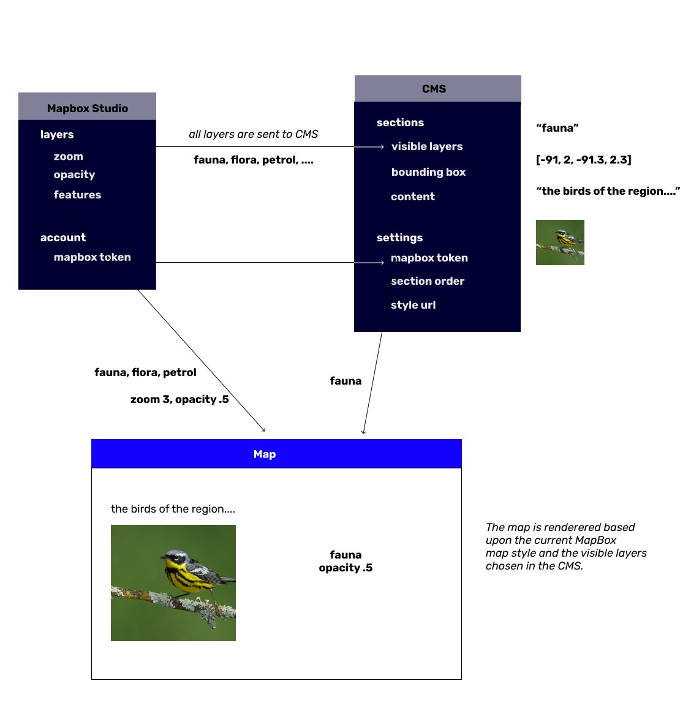

# interactive-maps

Build interactive webmaps using Mapbox and a content management system.

## How does this work?

This is a content management system (CMS) for attaching rich text to create an interactive story alongside a map. It is deployed to Netlify as a static website. It also will continue to work offline, as it saves the map tiles and content to your device browser storage as you scroll. This is heavily drawn from the [Waorani resistance campaign, 'Our Rainforest is Not For Sale'](https://waoresist.amazonfrontlines.org/).

The map is renderered based upon a given MapBox map style and the visible layers chosen in the CMS at the opacity picked at that zoom level in Mapbox. See the below diagram for a quick overview of how the relevant information is pulled together to create the static map. 




## Troubleshooting


* **Layer failures.** A layer could fail to fade in or out or appear altogether. This could be caused by a miryad of reasons. The map will still function with the error, but the layers that fail won't look as originally intended.

  * *Can't get layer visibility.* The CMS allows you to specify which layers are visible at a particular zoom level of the story. We try to be smart and fetch the layer opacity from mapbox. If we can't get the layer opacity, the layer may not fade in or out as intended. 
  * *Layer is new or the name changed in Mapbox.* Layers aren't known automatically after Mapbox style is updated. The CMS won't know about the new layers that are available unless you tell it to update. The Section in the content management system needs to be updated after the Mapbox style is updated. You can do this  by opening up a section in the CMS, and adding the new layer (or the layer with the changed name) to the 'visible layers' box. 
  * *Debugging.* There should be error messages in the console in case a layer fails to fade in or out; although we may not be able to detect exactly the reason why a layer failed to render, it can give some helpful context. These errors will be shown in the Developer Console (Cmd+Shift+I).

* **Layer transition smoothness.** Before publishing, find which layers should be hidden between transitions and add them to the hidden layers in [`src/map_transition.js`](https://github.com/digidem/sinangoe-webmap/blob/master/src/map_transition.js#L14). This is a delicate choice, because if you hide too many layers, it'll look very rigid and not very smooth visually when scrolling. However, if you hide too few, it'll be very slow overall and hard to view on slow internet connection and older computers.


## Development

When editing the admin interface, for hot reloading:

```
npm run start:admin
```

When editing the map interface:

```
npm run start:map
```

For deploying

```
npm run build
http-server dist
```

## License

MIT
